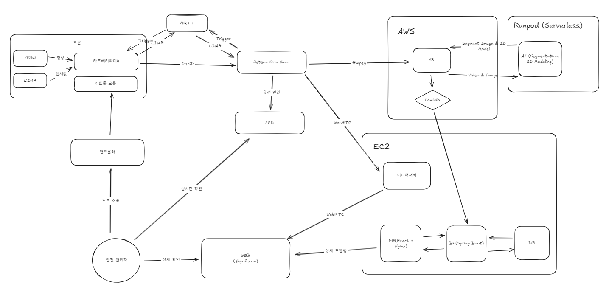
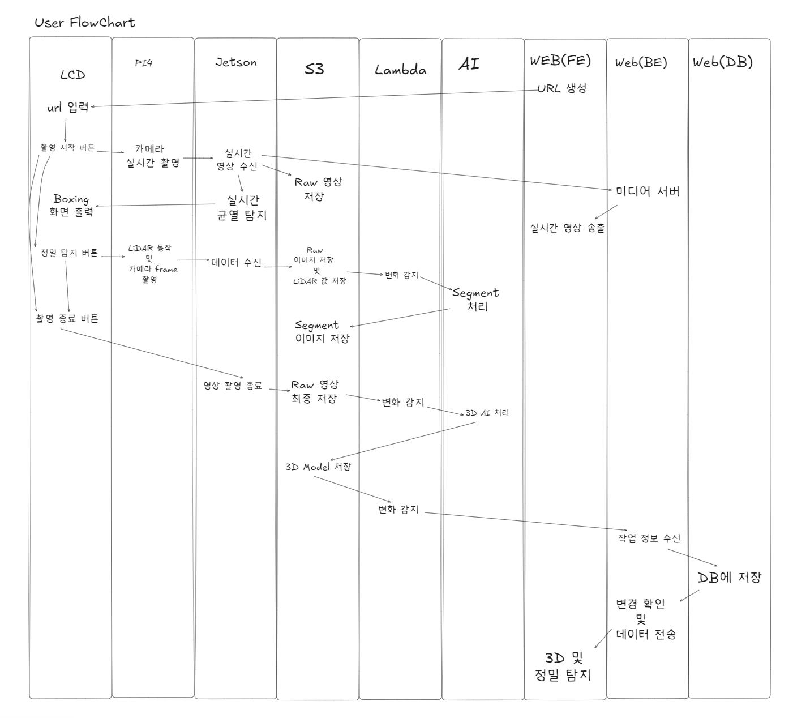

# CDD (Crack Detation Drone)

드론에 부착하여 균열 탐지를 수행할 수 있도록 하는 AIoT 서비스

## 개요
### 기간 : 7/14 - 8/17

### 인원 : 6명 (팀장: 문소윤, 팀원: 문빈, 유승현, 장철환, 조정래, 진효창)

### 작업 일정
Sprint1 (7/14 - 7/20) : 기획 ✓

Sprint2 (7/21 - 7/27) : 설계 ✓

Sprint3 (7/28 - 8/3) : 개발 및 중간 발표 1 ✓

Sprint4 (8/4 - 8/10) : 개발 및 중간 발표 2 ✓

Sprint5 (8/11 - 8/17) : 개발 및 최종 발표 준비 ✓

Sprint6 (8/18 - 8/22) : 발표 ✓

## 기획배경

그동안의 균열 탐지 방법은 사람이 직접 눈으로 확인하는 방식이었습니다.

하지만 이러한 방식은 비용과 많은 시간이 필요하고 많은 사람이 필요했습니다.

이 때문에 자주 검사할 수 없어 위험 요소를 뒤늦게 발견하기도 합니다.

이러한 문제를 해결하기 위해 드론을 통해 균열을 탐지하고자 하였습니다.

## 차별점

균열 탐지에서 그치지 않고, 라이다를 활용한 정밀 검사, 이미지 세그먼트, 3D 모델링 등으로 더 자세한 정보를 제공합니다.

## CDD 주요 기능 소개

1. Crack Detection : 실시간 영상에서 균열을 탐지하는 On-Device AI
2. Crack Segmentation : 균열을 정밀하게 탐지하는 AI
3. 3D Modeling : 촬영한 영상을 바탕으로 구조물을 3D 모델로 변환하고, 이를 활용해 균열의 위치와 크를 알 수 있게 합니다.

## 아키텍처 소개

## 유저 플로우차트

## 파트 별 역할
- Embedded : 문소윤, 유승현
- AI : 문빈, 조정래, 유승현, 장철환
- WEB : 진효창, 장철환, 유승현

## 역할 상세
| 파트       | 개발자 | 작업                                       | 작업물                                                                                                                   |
| -------- | --- | ---------------------------------------- | --------------------------------------------------------------------------------------------------------------------- |
| 문서       | 문소윤 | 중간 발표1 PPT 제작                            | [PPT1](https://www.canva.com/design/DAGusDYyric/qWsFGGX1pLcTjngtjfHk9A/edit)                                          |
| 문서       | 유승현 | Infra 및 아키텍쳐 설계                          | [[아키텍쳐 5차]]                                                                                                           |
| 문서       | 진효창 | API 설계                                   | [API문서](https://1nikuly037.apidog.io/)                                                                                |
| 문서       | 장철환 | Figma 작성                                 | [Figam](https://www.figma.com/files/team/1521835363839329961/project/409403809/Team-project?fuid=1244578519188196494) |
| 문서       | 전원  | Notion                                   | [Notion](https://www.notion.so/SSAFY-AIoT-22203d7e871380968f41e5f363e2e073)                                           |
| 발표       | 문소윤 | 중간 1차 발표                                 |                                                                                                                       |
| Embedded | 문소윤 | 라즈베리파이4와 Jetson Orin Nano 내부망 RTSP 무선 통신 |                                                                                                                       |
| Embedded | 문소윤 | 라이다 MQTT 통신 구현                           |                                                                                                                       |
| Embedded | 문소윤 | Yolov8n Jetson 보드에 탑재 및 라이브러리 버전 문제 해결   |                                                                                                                       |
| Embedded | 문소윤 | 드론 조립 및 조종                               |                                                                                                                       |
| Embedded | 문소윤 | Flask 개발                                 |                                                                                                                       |
| Embedded | 유승현 | LiDAR 설정 및 균열 탐지                         |                                                                                                                       |
| Embedded | 장철환 | FE 개발 (LCD 화면 구현)                        |                                                                                                                       |
| AI       | 문빈  | Segment AI 개발 (FCN, SegNet)              |                                                                                                                       |
| AI       | 문빈  | 3D AI 개발 (Nef, 3D Gaussian Splatting)    |                                                                                                                       |
| AI       | 문빈  | 3D AI 배포 (Serverless)                    |                                                                                                                       |
| AI       | 조정래 | Segment AI 배포 (Serverless)               |                                                                                                                       |
| AI       | 조정래 | Segment AI 개발 (DeepLab, U-Net)           |                                                                                                                       |
| AI       | 조정래 | Yolov8n 최적화 (데이터 전처리 및 추가 학습)            |                                                                                                                       |
| AI       | 유승현 | Yolov8n 개발 (데이터 전처리 및 1차 학습)             |                                                                                                                       |
| AI       | 유승현 | 3D AI 개발 (Neuralangelo, TripoSR)         |                                                                                                                       |
| AI       | 장철환 | Segment Dataset 전처리                      |                                                                                                                       |
| Web      | 장철환 | FE 개발 (3D Model 시각화 구현)                  |                                                                                                                       |
| Web      | 진효창 | BE 개발 (인증 기능 구현)                         |                                                                                                                       |
| Web      | 진효창 | S3 및 DB 설계                               |                                                                                                                       |
| Web      | 유승현 | 1:N WebRTC                               |                                                                                                                       |
| Web      | 유승현 | AWS 세팅                                   |                                                                                                                       |

