# CDD (Crack Detect Drone)

## 목차

1. 개요
2. 버전
3. 환경 변수
4. 빌드
5. 배포
6. 외부 서비스
7. 시연 시나리오


## 개요

그동안의 균열 탐지 방법은 사람이 직접 눈으로 확인하는 방식이었습니다. 하지만 이러한 방식은 비용과 많은 시간이 필요하고 많은 사람이 필요했습니다. 이 때문에 자주 검사할 수 없어 위험 요소를 뒤늦게 발견하기도 합니다.

이러한 문제를 해결하기 위해 드론을 통해 균열을 탐지하고자 하였습니다. 드론에 고해상도 카메라와 AI 기반 균열 인식 시스템을 탑재하여 자동으로 균열을 감지하고, LiDAR 센서를 통해 균열의 깊이까지 정확하게 측정할 수 있도록 구현했습니다.

수집된 데이터는 웹 기반 3D 시각화 플랫폼을 통해 사용자가 직관적으로 현장 상황을 파악할 수 있도록 제공됩니다. 사용자는 브라우저에서 3D 환경을 통해 균열의 위치, 크기, 심각도를 실시간으로 확인하고 분석할 수 있습니다.

이를 통해 기존 방식 대비 검사 시간을 크게 단축하고 비용을 절감하면서도, 위험 지역에 인력을 투입하지 않고도 정확하고 객관적인 구조물 안전 점검이 가능한 통합 솔루션을 구축하였습니다.

## 버전

**WEB**
- [JDK 17 3.5.4](https://www.oracle.com/java/technologies/javase/jdk17-0-13-later-archive-downloads.html)
- [Intellij IDE 2025.1.3 (Runtime version: 21.0.7+9-b895.130 amd64 (JCEF 122.1.9))](https://www.jetbrains.com/idea/download/?section=windows)
- [Visual Studio Code 1.103.1](https://code.visualstudio.com/docs?dv=win)
- [React 18.2.43](https://github.com/facebook/react/releases/tag/v18.2.0)

**AI (Yolo)**
- [Yolov8n](https://docs.ultralytics.com/ko/models/yolov8/)
- [Pytorch 2.3.0](https://pytorch.kr/get-started/previous-versions/)
- WSL2 (Ubuntu 22.04)


**AI (DeepLab)**
- [CUDA 11.8](https://developer.nvidia.com/cuda-11-8-0-download-archive)
- [CuDNN 8.9.7](https://developer.nvidia.com/rdp/cudnn-archive)
- [Pytorch 2.1.0](https://pytorch.kr/get-started/previous-versions/)
- WSL2 (Ubuntu 22.04)

**AI (3D Gaussian Splatting)**
- [CUDA 11.8](https://developer.nvidia.com/cuda-11-8-0-download-archive)
- [CuDNN]()
- [Pytorch]()
- WSL2 (Ubuntu 22.04)

**DRONE**
- [ArduPilot Firmware](https://firmware.ardupilot.org/)
- [Raspberry Pi 4](https://www.raspberrypi.com/products/raspberry-pi-4-model-b/)
- [Jetson Orin Nano](https://www.nvidia.com/en-us/autonomous-machines/embedded-systems/jetson-orin/nano-super-developer-kit/)
- [YDLidar-SDK](https://github.com/YDLIDAR/YDLidar-SDK)
- [YDLiDAR X4-Pro](https://www.ydlidar.com/product/ydlidar-x4-pro)
- [로지텍 코리아 BRIO 100](https://www.logitech.com/ko-kr/shop/p/brio-100-webcam)
- [S500 쿼드콥터 드론 PDB 에디션 Kit](https://www.falconshop.co.kr/shop/goods/goods_view.php?goodsno=100091886&category=064001070)
- [win-usbipd](https://github.com/dorssel/usbipd-win)
- Battery (전압, 전류량)
- cmake


## 환경 변수

**FE**
.env
```.env
VITE_API_BASE_URL=
VITE_API_PROXY_TARGET=
VITE_DEMO_MODE=
```

**BE**
.env
```.env
MYSQL_ROOT_PASSWORD=
MYSQL_DATABASE=
MYSQL_USER=
MYSQL_PASSWORD=
SPRINT_DATASOURCE_USERNAME=
SPRING_DATASOURCE_PASSWORD=
JWT_SECRET=
AWS_S3_BUCKET=
```

**AI(Segment)**
.env
```.env
AWS_BUCKET_NAME=
AWS_ACCESS_KEY_ID=
AWS_SECRET_ACCESS_KEY=
AWS_REGION=
LOKI_URL=
```


## 빌드

리포지토리 복제
```bash
git clone https://lab.ssafy.com/s13-webmobile3-sub1/S13P11B102.git CDD
```

front
```bash

```

back
```bash

```

raspberray pi4
```bash

```

jetson orin nano
```bash

```

ai(detect)
```bash

```

ai(segment)
```bash

```

ai(3d model)
```bash

```


## 3. 배포

web

raspberry pi4

jetson orin nano

pixhawk

aws

gcp


## 4. 외부 서비스
# 외부 서비스

1. AWS
2. GCP

## AWS
### S3

- 퍼블릭 액세스 허용
- 버킷 정책

```json
{
    "Version": "2012-10-17",
    "Statement": [
        {
            "Sid": "Statement1",
            "Effect": "Allow",
            "Principal": "*",
            "Action": [
                "s3:GetObject",
                "s3:PutObject"
            ],
            "Resource": "arn:aws:s3:::cdd-public-bucket/*"
        }
    ]
}

```

- CORS

```json
[
    {
        "AllowedHeaders": [
            "*"
        ],
        "AllowedMethods": [
            "GET",
            "HEAD"
        ],
        "AllowedOrigins": [
            "<http://localhost:5173>",
            "<https://antimatter15.com>",
            "<http://43.203.222.137>"
        ],
        "ExposeHeaders": [
            "ETag",
            "Content-Length",
            "Accept-Ranges",
            "Content-Range",
            "Content-Type"
        ],
        "MaxAgeSeconds": 3600
    }
]

```

### Lambda

**1. 정밀탐지 (Segment)**

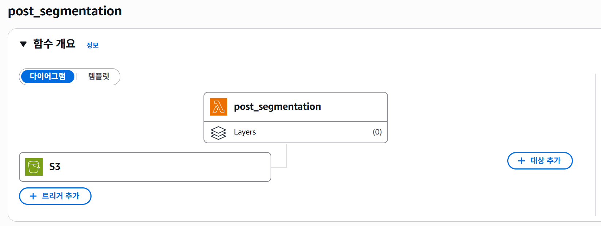


Trigger : S3에서 image.jpeg 생성

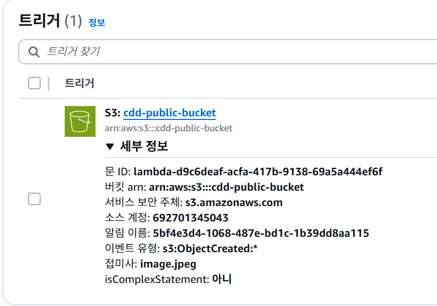

---

**2. 영상 통합 (video.mp4, detect.mp4)**

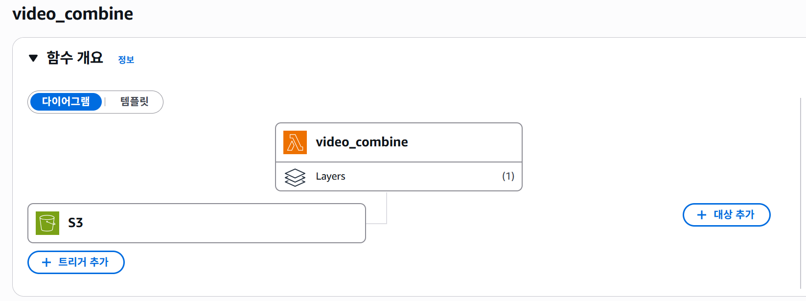


권한 : 기본 권한 + AmazonS3FullAccess

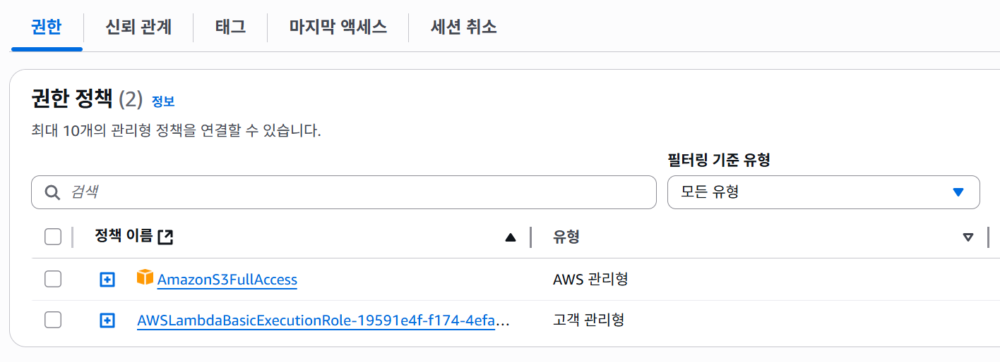


Layers : ffmpeg Layer 필요.


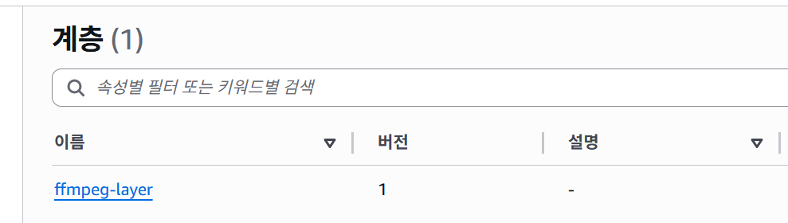

> 1. ffmpeg-release-amd64-static.tar.xz - md5 설치 (https://johnvansickle.com/ffmpeg/)
> 2. 압축 해제 후 다시 zip 압축
> 3. layer 등록
        

Trigger : S3에 finish.txt 객체 생성

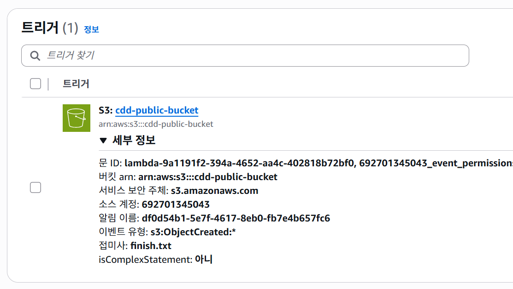

---

**3. 3D 렌더링**

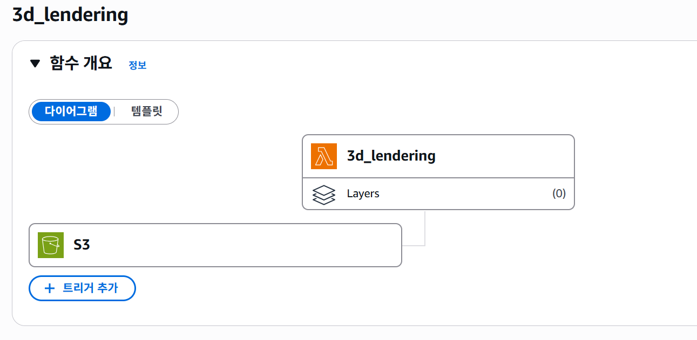

Trigger : S3에 video.mp4 객체 생성

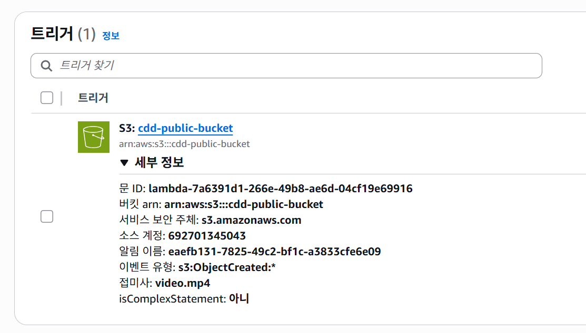

---

**4. 백엔드 저장**

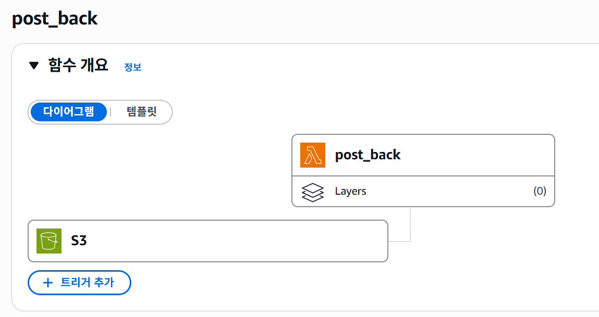


권한 : 기본 권한 + AmazonS3FullAccess

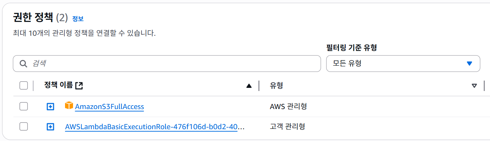


Trigger : S3에 model.splat 객체 생성

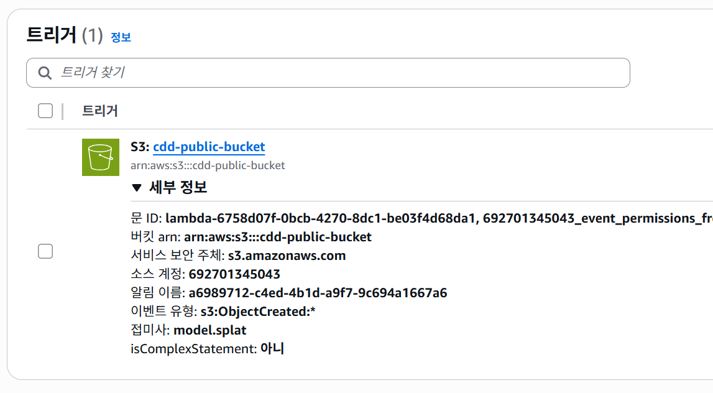


## GCP


### **Artifact Registry**


저장소 만들기

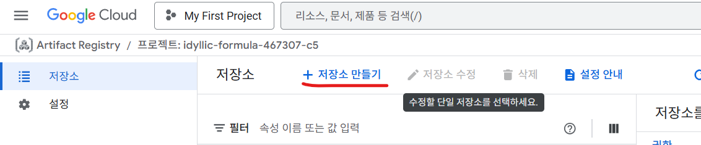


저장소 설정 1

.png)


저장소 설정 2

.png)


저장소 설정 3

.png)


### **Cloud Build**


저장소 연결

.png)


호스트에서 GitLab 선택, 자체관리형

.png)


GitLab 토큰 등록

.png)


저장소 연결

.png)


호스트 선택

.png)


레포지토리 선택 (maintainer 이상 권한 필요)

.png)


브랜치 커밋 감지를 위한 트리거 생성

.png)


트리거 만들기

.png)


이벤트 → 브랜치로 푸시 설정(정규 표현식)

.png)


이전에 생성한 저장소 선택

.png)


cloudbuild.yaml파일의 상대 경로 입력

.png)


서비스 계정 설정 후 만들기 버튼 클릭
> Cloud Build workpool 사용자
> Artifact Registry 작성자
> Cloud Run 관리자


### Cloud Run
> Google Cloud SDK를 사용해서, cloudbuild.yaml 파일에서 자동으로 cloud run instance 만들고 배포할 수 있게끔 함

```yaml
# cloudbuild.yaml 파일에서 cloud run 부분

- name: 'gcr.io/google.com/cloudsdktool/cloud-sdk'
    entrypoint: 'gcloud'
    args:
      - 'run'
      - 'deploy'
      - '${_SERVICE_NAME}'
      - '--image=${_AR_HOSTNAME}/${PROJECT_ID}/${_REPO_NAME}/${_SERVICE_NAME}:${COMMIT_SHA}'
      - '--region=${_DEPLOY_REGION}'
      - '--platform=managed'
      - '--allow-unauthenticated'
      - '--port=8000'
      - '--cpu=4'
      - '--memory=16Gi'
      - '--gpu=1'
      - '--gpu-type=nvidia-l4'
    id: 'Deploy'
```

> Region은 시드니로 설정해야 GPU 사용 가능

---

### Monitoring Server


Google Cloud -> Compute Engine -> 인스턴스 만들기

.png)


리전 서울로 설정

.png)


EC2 CPU 사용하도록 설정

.png)


머신 유형 `e2-medium`

.png)


디스크 크기 20GB & OS 설정

.png)


네트워킹 HTTP, HTTPS 열기

.png)


>HTTPS는 내도메인.한국에서 도메인 발급 받고, VM IP 주소 설정
>certbot 이용해서 HTTPS 요청이 Nginx에 들어오도록 설정
>Nginx에서 3100 포트로 loki와 연결, 3000 포트로 grafana와 연결


## 5. 시연 시나리오
1. raspberry pi4에서 서버를 실행한다.
```BASH

```
2. jetson orin nano 보드에 전원을 연결한다. (자동으로 AP 연결됨)
3. 핫스팟을 통해 jetson과 외부 네트워크를 연결한다.
4. 노트북으로 https://shyo2.com에 접속하여 로그인한다.
5. 작업을 생성한다.
6. 생성된 url에서 유저id와 작업id를 각각 lcd(jetson orin nano)에 입력한다.
7. power버튼을 통해 촬영을 진행한다.
8. 드론을 띄운다
9. 균열을 탐지하면 균열 앞에 드론을 호버링한다.
10. lcd에서 정밀탐지 버튼을 클릭하여 정밀 탐지를 시작한다. (반복)
11. 촬영이 끝나면 logout 버튼을 통해 작업을 종료한다.
12. 잠시 기다린 후 영상과 균열 사진, 3d 화면을 확인한다.